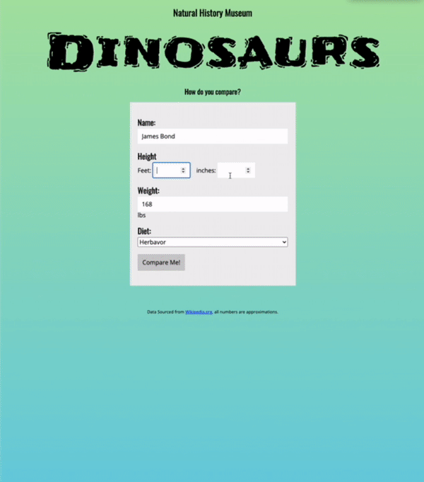

# Object Oriented JavaScript

A simple web page to showcase Object Oriented JavaScript building. Part of [Udacity's JavaScript Nanodegreee](https://www.udacity.com/course/intermediate-javascript-nanodegree--nd032).

  

## Instructions

1. Clone the repo or download all the files
2. Install a fake JSON Server with `npm install -g json-server`
3. Run the json server with `json-server --watch dino.json`
4. Open the file `index.html`

## Authors

- Ivan Cheng
